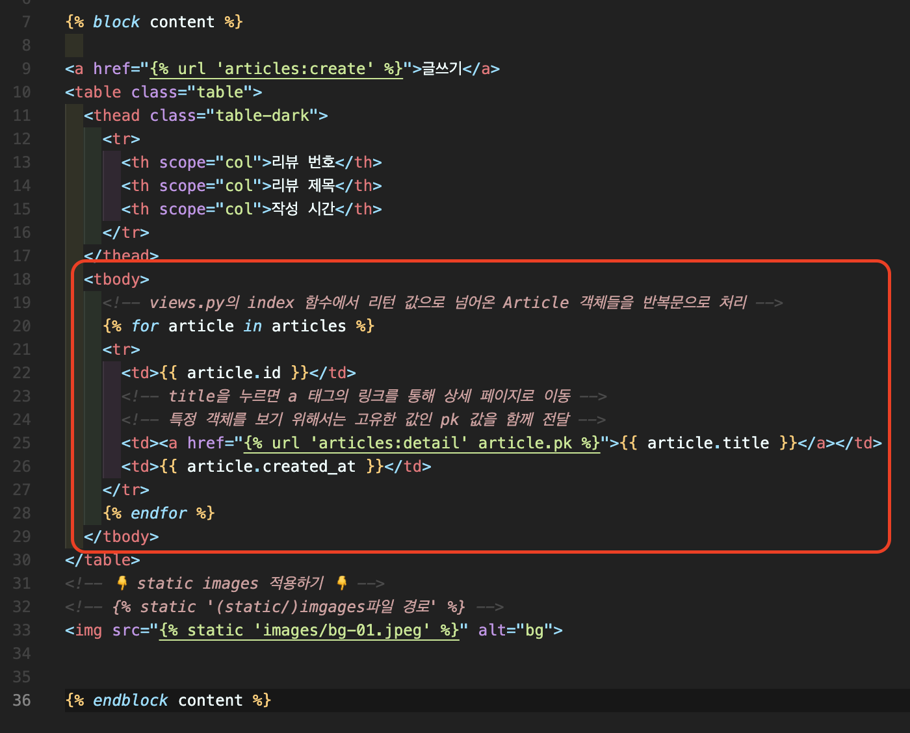

# CRUD 구현 📝

> url로 요청 📩 받아 view에서 처리 🧩 하고 template으로 응답 📤 하는 과정을 반복합니다.

<br />

## **1. url 요청 📩**


<br />

## **2. view 처리 🧩**


<br />

## **3. template 응답 📤**



<br />

## **CREATE 📗**

> 요청(url) -> 처리(view) -> 응답(template)으로 데이터 생성하기 💡
>
> - HTML Form에서 URL 요청
> - 요청 후 urls.py 경로를 통해 views.py로 이동
> - ⁉️ 유효성 검사를 통과하였다면 요청 값을 저장해 인덱스 페이지로 이동하고,
> - ⁉️ 통과하지 못했다면 생성 페이지로 리턴하게 됩니다.

<br />

## **READ 📙**

> 요청(url) -> 처리(view) -> 응답(template)으로 데이터 조회하기 💡
>
> - HTML Form에서 URL 요청
> - 요청 후 urls.py 경로를 통해 views.py로 이동
> - ⁉️ 특정 객체를 조회하기 위해서는 객체의 고유한 값인 pk 값을 인자로 받아 사용합니다.
> - ⁉️ 가져온 값을 다시 template으로 랜더링합니다.

<br />

## **UPDATE 📒**

> 요청(url) -> 처리(view) -> 응답(template)으로 데이터 수정하기 💡
>
> - HTML Form에서 URL 요청
> - 요청 후 urls.py 경로를 통해 views.py로 이동
> - ⁉️ 특정 객체를 수정하기 위해서는 객체의 고유한 값인 pk 값을 인자로 받아 사용합니다.
> - ⁉️ 정의한 Form에 값을 넣기 위해서는 instace를 정의하게 됩니다.
> - ⁉️ 유효성 검사를 통과하였다면 요청 값을 저장해 리런하고,
> - ⁉️ 통과하지 못했다면 수정 페이지로 리턴하게 됩니다.

<br />

## **DELETE 📕**

> 요청(url) -> 처리(view) -> 응답(template)으로 데이터 삭제하기 💡
>
> - HTML Form에서 URL 요청
> - 요청 후 urls.py 경로를 통해 views.py로 이동
> - ⁉️ 특정 객체를 삭제하기 위해서는 객체의 고유한 값인 pk 값을 인자로 받아 사용합니다.
> - ⁉️ 모델에서 pk 값이 동일한 객체를 불러와 삭제하고 인덱스 페이지로 랜더링합니다.

<br />

---

# STATIC FILE 📝

> 정적 파일이란, 응답할 때 별도의 처리없이 파일 내용을 그대로 보여주면 되는 파일을 말합니다.

<br />

## **1. 추가 정적 파일 적용 💭**

> app 안에 정적 파일 경로 외에 추가적인 정적 파일 경로 목록을 정의합니다.

```
<파일 경로>
project
  | static
      | css
          | style.css
```


<br />

## **2. 정적 파일 활용하기 💭**


